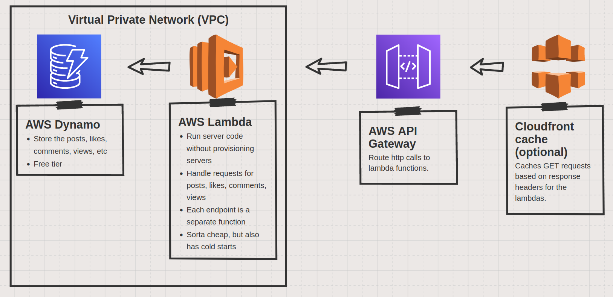

## Possible Architectures

#### Static pre-rendered site hosted on S3

**Likes:**
- Somewhat easy to set up (with pulumi for example)
- Simple deployments - just upload files to S3
- Can be statically generated with next
- Good SEO, ez clap cache
- Very fast page loading times
- Dirt cheap

**Yikes:**
- Needs redeployment to change post content (doesn't take a lot of time, but is annoying)
- Images need to be handled a bit awkwardly with nextjs
- Needs a separate backend to handle stuff like comments, likes, view count, etc
  - Some view info can be captured by bucket logs maybe?

#### NextJS on vercel + AWS Dynamo

**Likes:**
- Stupid easy to deploy
- Good SEO with SSR
- Essentially free
- Posts can be dynamic, so no need to redeploy to add/edit posts
- Comments, views, likes are easily possible
- Domain/DNS/Certificate provided by vercel
- Pretty decent for a quick start
- Can also bite the bullet and have the posts be statically rendered

**Yikes:**
- Less opportunity to learn
- Vercel function cold start times are ugh for the free tier
- Vercel free tier offers only one availability zone (maybe cloudfront can be used?)

#### Dedicated backend architecture

**Likes:**
- Should be cheap
- Can use cloudfront to cache a lot of stuff
- 4 Different AWS service to explore
- Can work with NextJS on vercel or a site deployed on S3
- Deployment doesn't seem complicated
- SEO can be good with NextJS

**Yikes:**
- **Cold starts**
- Caching will need some tuning
- **Double cold starts** with NextJS - one for the nextjs page, one for the aws lambda
- I'm clueless about lambda local development

## Tech stacks
- NextJS - makes a lot of things easy, but needs the server to be hosted somewhere for SSR.
- Vite - Good for a single page app. Supports SSR (which would require a server obviously).
